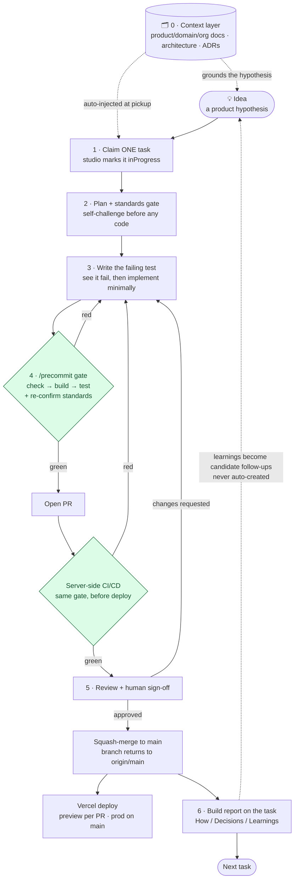

# The Builder's Journey

> A narrative walkthrough of what it's actually like to ship one change here — and what the
> framework quietly enforces at every step. If [`FRAMEWORK.md`](../FRAMEWORK.md) is the *what*
> (the 7 opinions) and [`sdlc/core.md`](../sdlc/core.md) is the *spec*, this is the *story*.

## For builders

"Builder" used to mean an engineer. Product people wrote the *why*, engineers wrote the *how*, and
work got thrown over the wall between them. That wall is gone here. A builder is anyone — or
anything — that moves a hypothesis toward shipped, reviewed, traceable software: the person shaping
an idea, the person implementing it, **and the AI agents that walk this same road autonomously.**
Same lifecycle, same gates, same lineage, whoever's hands are on it.

So this walkthrough asks everyone to care about the whole loop, not just their slice:

- the part that makes the work **trustworthy** — tests first, a gate that can't be skipped, one
  human sign-off — matters as much to whoever pitched the idea as to whoever wrote the code;
- the part that makes the work **matter** — the hypothesis, its validation status, the learnings in
  the build report — matters as much to the engineer as to the PM.

You'll hear two voices in the stages ahead — one pulled toward *why we're building this*, one toward
*how the rail holds*. They're the same journey, not two tracks; by the end the distinction stops
being useful. There are just builders, and a road they all walk.

This doc is also the **source for the demo deck** — each section maps to a slide (see
[Deck mapping](#deck-mapping)), so the story you read here is the story we tell on stage.

## Why the framework is opinionated

Most agent tools hand you a chat box and a sandbox. This repo demonstrates a **paved road**: one
software-development lifecycle that every builder — a human in an editor or a fully autonomous
agent — walks *identically*, every time. The central bet is that **drift is the enemy**: drift
between people, between the interactive and headless paths, and between "what we said our process
is" and "what actually happened." Every opinion exists to remove a source of drift — and crucially,
the important ones are **gates the builder cannot skip**, not documentation they might read. The
journey below is what walking that road feels like, one step at a time.

## The journey at a glance

The rest of this doc walks each numbered stage. *(Stage sections below are filled in by the
idea #6 stage tasks — see each heading.)*

---

## Stage 0 — The context layer: grounded ideas & grounded execution

Before a single task is claimed, the work already knows where it stands. Ideas and tasks here aren't
free-floating text — they're grounded in a **context layer**: the product's strategy and the
domain's hard-won knowledge, attached to the work and carried with it. This is the floor the whole
journey rests on. Skip it and you get confident-sounding work pointed at the wrong thing; build on
it and every later gate is checking something that was worth building in the first place.

**Grounding the _why_.** An idea doesn't start as a guess typed into a box. The product's strategy,
vision, and PRD are loaded first (`load_product_context`), and a spec-writer drafts the hypothesis
_against_ that context — so the bet is anchored to where the product is actually going, not to
whoever argued hardest. Domain knowledge — the catalogue's quirks, prior research, org conventions —
is attached to the idea (`attach_context`) so it travels with the hypothesis. And because context
attached to an idea is **inherited by every task spun out of it**, that grounding flows downstream
automatically: decompose an idea into tasks and each one starts from the same footing.

**Grounding the _how_.** Execution needs a different kind of context, and it attaches at the task:
the architecture rulebook, design docs, ADRs — the decisions a builder must not silently
re-litigate. These are curated onto the task (`attach_context`, drawing on knowledge-base docs,
indexed documents, or files synced straight from the GitHub repo), and the studio standards ride
along as context too (they are stored as context documents). The constraints arrive _with_ the work,
not in a wiki someone might think to open.

**Injected, not hunted for.** None of this depends on remembering to go read it. When a task is
claimed (`work_on_next_task` — Stage 1), its context — its own, plus whatever it inherited from its
idea — is injected directly into the builder's working context. This very section is the proof: the
task that wrote it was picked up with five repo documents already attached and in front of the
builder — `README.md`, `ARCHITECTURE.md`, `FRAMEWORK.md`, `SETUP.md`, `CLAUDE.md`. A builder can
pull more in on demand (`search_context`) or curate the set (`attach_context` / `remove_context`).

And "the builder" is deliberately literal here: a human reads the injected context in their editor;
an autonomous agent receives the identical payload at pickup. Same grounding, same constraints,
whoever — or whatever — picks up the work. That shared footing is what makes the next stage,
claiming a task, the start of a journey rather than a leap in the dark.

## Stage 1 — Pick up work

> _Filled in by task #13 (Stage 1 — Pick up work)._ The studio as the single source of truth;
> ideas → tasks; claiming **exactly one** task and why; the context from Stage 0 is injected here;
> the agent fleet.

## Stage 2 — Plan & the standards gate (touch 1)

> _Filled in by task #14 (Stage 2)._ Reading the spec + standards; the plan self-challenge before
> any code; standards as data (no-mocks; campground rule); this is the first of two gate touches.

## Stage 3 — Build test-first

> _Filled in by task #15 (Stage 3)._ The failing test before the code, watching it fail,
> implementing the minimum; the campground rule on touched files; the architecture rulebook and
> real-services testing.

## Stage 4 — Ship through the gate & the CI/CD pipeline

> _Filled in by task #16 (Stage 4)._ `/precommit` as the only door; the gate order
> (check → build → test); standards re-confirm (touch 2); the PR; the server-side CI/CD pipeline
> that runs the same gate before deploy; Vercel preview/prod.

## Stage 5 — Review, sign-off & merge

> _Filled in by task #17 (Stage 5/6)._ The review cycle and the single human touchpoint; the
> changes-requested loop; explicit approval; squash-merge; the branch returning to `origin/main`.

## Stage 6 — Visibility & the learning loop

> _Filled in by task #17 (Stage 5/6)._ The 3-section build report; learnings as candidate
> follow-ups (never auto-created); execution events and the agent stream; how all of this elevates
> visibility — the deck framing.

---

## Deck mapping

Each section maps to a slide, so this doc is the deck's script. (Aligned with the ~6-minute demo
narrative in [`FRAMEWORK.md`](../FRAMEWORK.md#suggested-demo-narrative-6-minutes).)

| Slide | Doc section | The one-line message |
|-------|-------------|----------------------|
| 1 — Hook | For builders | "Engineers, product, agents — all builders on one road. The wall between them is gone." |
| 2 — Why a paved road | Why the framework is opinionated | "Drift is the enemy; the rails that matter are gates you can't skip." |
| 3 — Grounded in context | Stage 0 — The context layer | "Ideas and execution are grounded in real domain/org context — not guesses; injected automatically." |
| 4 — The loop | The journey at a glance (diagram) | "Every change walks this exact path." |
| 5 — Work is a record | Stage 1 — Pick up work | "Work is a typed task you claim — one at a time — not a prompt." |
| 6 — Standards can't be skipped | Stage 2 — Plan & standards gate | "Principles are a gate the builder answers to, before any code." |
| 7 — Test-first, for real | Stage 3 — Build test-first | "The failing test comes first; tests hit real services, never mocks." |
| 8 — One door | Stage 4 — Ship through the gate & CI/CD | "`/precommit` is the only way in; CI re-runs the gate before deploy." |
| 9 — One human touchpoint | Stage 5 — Review, sign-off & merge | "A human signs off once; the branch resets clean every time." |
| 10 — The kicker | Stage 6 — Visibility & the learning loop | "Build reports + lineage make the invisible work visible — and it scales to a fleet." |

---

## Source documents

This narrative synthesizes (and must stay accurate to) the authoritative docs:

- [`FRAMEWORK.md`](../FRAMEWORK.md) — the 7 opinions and the demo narrative.
- [`sdlc/core.md`](../sdlc/core.md) — the one SDLC step sequence both runtimes render.
- [`ARCHITECTURE.md`](../ARCHITECTURE.md) — how code is shaped (ports & adapters, real-services testing, the gate).
- [`standards/`](../standards/) — the active gate (no-mocks; campground rule).
- [`docs/lineage.md`](lineage.md) — Idea → Task → PR → Build Report.
- The studio task model — ideas, tasks, executions, build reports over the studio-ai MCP.
